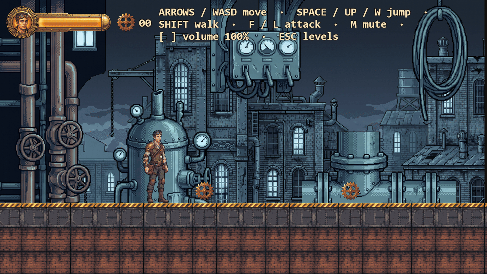
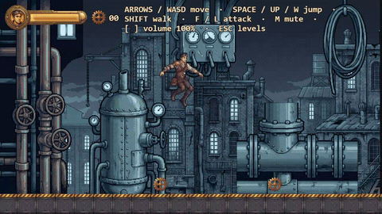

# Steampunk Platformer

A short browser platformer — five levels, Victorian industrial steampunk, every pixel and every
sound generated through [fal.ai](https://fal.ai). Built in ten sessions as a learning exercise, with
a hard QA gate at the end of every one.



**▶ Play it: <https://steampunk-platformer-jet.vercel.app/>**

**Arrows / WASD** move · **Space / Up / W** jump · **Shift** walk · **F / L** attack · **M** mute ·
**[ ]** volume · **Esc** level select. On a phone, on-screen controls appear instead.

---

## The game

You are the **brass courier**, crossing five levels of a Victorian factory city to reach the gate at
the end of each one.



<sub>▶ Longer clip, full size: **[docs/media/gameplay.mp4](docs/media/gameplay.mp4)** (1280 × 720, 12 s).
Both are captured from the live deployment by `node tools/dev/capture-readme-media.mts`.</sub>

- **Move and jump.** Variable-height jumps — the longer you hold, the higher you go. Holding
  **Shift** walks instead of runs. There is a coyote-time window after leaving a ledge and a jump
  buffer before landing, and the two are deliberately *not* symmetric.
- **Fight, or don't.** Two enemies: the **rust scavenger** chases and swings; the **brass sentry**
  holds position and fires. Both are fully deterministic — neither reads the random stream, so a
  fight plays out the same way twice.
- **Get hurt.** Spikes take 20 of your 100 health. Falling below the kill plane ends the run and
  respawns you.
- **Collect gears** scattered through each level; the counter sits beside the health bar.
- **Progress is saved** to `localStorage` — levels unlock in order, and **Esc** opens the level
  select for anything you have already reached.

Five levels ship: `level-01` through `level-05`, authored in [Tiled](https://www.mapeditor.org/).

## Run it

```bash
npm ci
npm run dev          # http://localhost:5173
```

Built and tested on Node 24. The runtime dependency list is one package.

## Tech stack

| | |
|---|---|
| **Engine** | [Phaser 4.2.1](https://phaser.io) — pinned exact, and the **only** runtime dependency |
| **Language** | TypeScript 7 (the Go port), `strict`, with `noUnusedLocals` and `verbatimModuleSyntax` on |
| **Build** | Vite 8, with two custom `dist/` gates bolted to the end of it |
| **Levels** | [Tiled](https://www.mapeditor.org/) `.tmj`, shipped as data and validated at boot |
| **Art & audio** | Generated through [fal.ai](https://fal.ai); sheets cut by `npm run assets:build` |
| **Unit tests** | vitest — **3,154 tests in 225 files, 21 s**, because the simulation has no engine in it |
| **Browser tests** | Playwright — **236 tests** across seven projects, including a production-bundle project and a WebKit one |
| **Hosting** | Vercel, static, behind a strict CSP declared in [vercel.json](vercel.json) |

**The world contract**, which everything else is measured against: a **96 px** grid, a **60 Hz**
fixed tick, a **1920 × 1080** design view whose **height is invariant** while its width adapts to the
viewport's own aspect ratio (up to 2560), and a 132 × 288 px character drawn at scale 6.
`src/game/constants.ts` is the authority for all of it.

## How it's built

**The simulation has no engine in it.** `src/sim/` imports nothing from Phaser, reads no clock, calls
no `Math.random`, and touches no DOM. It is a pure function of `(state, input) -> state` with every
duration expressed as an integer count of 60 Hz ticks and every distance in pixels. That is what
makes the whole of the game logic unit-testable in milliseconds, and `npm run test:sim-isolated`
proves it by uninstalling Phaser and running the suite anyway.

Four layers, and the boundaries between them are the design:

| | |
|---|---|
| `src/sim/` | the fixed-tick simulation. Pure, deterministic, engine-free. No physics library — the collision is ours. |
| `src/game/frameClock.ts` | the seam. Milliseconds exist here and stop here: it accumulates real elapsed time from a variable-rate `requestAnimationFrame` and drains whole ticks out of it, capped so a stalled tab cannot produce a thousand-tick catch-up. |
| `src/render/` | engine-free decision functions — which frame, which flip, which camera bounds. The scene only applies the result, which is what makes their edge cases reachable from a unit test. |
| `src/scenes/` | the only place Phaser lives. |

**The tick order is a numbered, published contract.** `src/sim/tick.ts` declares fourteen steps in a
fixed order; combat timing is expressed against those numbers and animation frame rates derive from
windows that slot into them. Renumbering it is a balance change, not a refactor.

**Collision is data, not names.** A level's solid geometry is an object layer of rectangles carrying
a `solid` property; nothing in the codebase resolves a layer or a tileset by its name.

**The build ends in a gate rather than a bundle.** `tools/gen/verify-dist.mjs` fails the build if a
dev-only scene key, a debug symbol or a line of dev-facing prose reaches `dist/`, and asserts every
`.tmj` arrived byte for byte. A second gate, `tools/gen/devSeamGate.mjs`, fails it if any
`import.meta.env.DEV` body survived minification — each guarded body carries a string sentinel that
folds away with it, so absence is proved rather than grepped for.

**The art pipeline is reproducible in one direction and honest about the other.** Every generation
is logged with its prompt and its `request_id` in [docs/GENERATION-LOG.md](docs/GENERATION-LOG.md),
sheets are cut from the raws by `npm run assets:build`, and the raws themselves cannot be
regenerated from this repository — see [ASSETS-LICENSE.md](ASSETS-LICENSE.md).

## Commands

```bash
npm run dev                # Vite dev server on :5173
npm run build              # typecheck x2, vite build, then the dist gates
npm run typecheck          # tsc --noEmit alone — the fastest full check
npm test                   # vitest: the sim, plus the doc and style locks
npm run test:e2e           # Playwright, seven projects (see playwright.config.ts)
npm run test:sim-isolated  # uninstall Phaser, run the unit suite, reinstall
```

## Documentation

Everything below `docs/` is the project's working record, not marketing. The useful entry points:

| | |
|---|---|
| [docs/PRD.md](docs/PRD.md) | the spine: the phase table, the constraints, the review protocols |
| [docs/TESTING-RULES.md](docs/TESTING-RULES.md) | every testing rule here, and the false green that paid for it |
| [docs/LESSONS-APPLIED.md](docs/LESSONS-APPLIED.md) | 133 vault notes distilled into hard requirements |
| [docs/ENGINE-NOTES.md](docs/ENGINE-NOTES.md) | Phaser behaviour already paid for in debugging time |
| [docs/ASSET-PIPELINE.md](docs/ASSET-PIPELINE.md) | generation → sheet → catalog |
| [docs/QA-LOG.md](docs/QA-LOG.md) | every measurement, decision and deliberate non-fix |

If you read one, read `TESTING-RULES.md`. Each rule in it cost a real false green or a real false
red, and the evidence is recorded beside it.

## Licence — two of them, and they are not the same

**Code: MIT.** `src/`, `tests/`, `tools/` and the root configuration files. See
[LICENSE](LICENSE).

**Art and audio: all rights reserved.** Everything under `public/assets/`, `assets/` and
`docs/media/` — no redistribution, no reuse in another project. See
[ASSETS-LICENSE.md](ASSETS-LICENSE.md).

Cloning the code under MIT gives you no rights to the assets. Build on the code; bring your own art.
